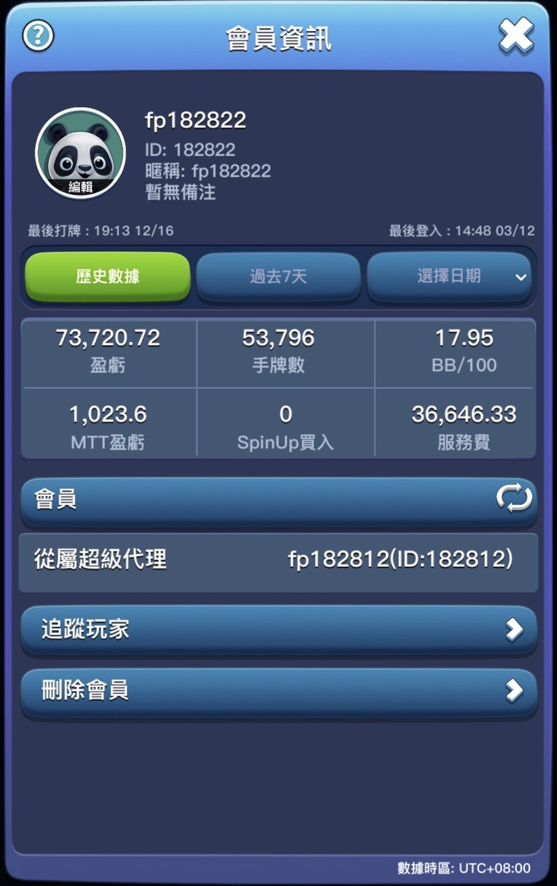
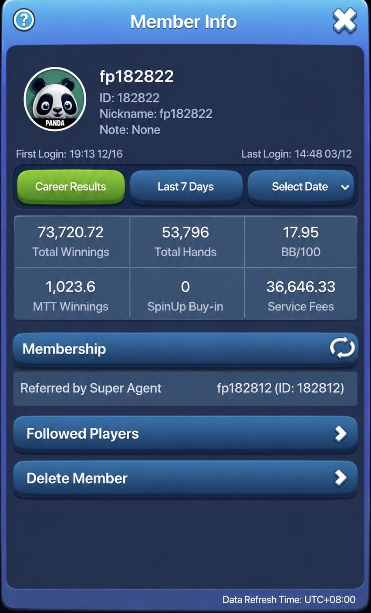

# My Poker Journey
## Overview

I am a cash game player. I start playing online since 2020. I played nearly 1 million hands on both public site and private clubs, and now I focus more on live games. I have decent results with valid proofs, my winrate is about 7BB/HH (big blinds per one hundread hands) on GGPOKER, and 18BB/HH in private online clubs.

I have strong understandings in modern poker theory. At the beginning, I use GTOWizard to study general themes such as preflop strategy and postflop optimal strategy. Then I study exploitation by "node lock" on Piosolver. I also download millions of hands to analysis player' tendency and build strategies to punish their deviation from optimal strategy.
I joined the best poker community in Taiwan, and luckily I have the best coaches and allies throughout my journey. We review handplays, form study groups, hold seminars and etc. All these stuff nurtures me to become a winning player.

### GGPOKER NL2 (Zoom)

### GGPOKER NL5-NL10 (Zoom)

### GGPOKER NL10-NL25 (Zoom)

### Online Private Club NL50

  
  

*I use ai to translate the text, LHS is the original image.